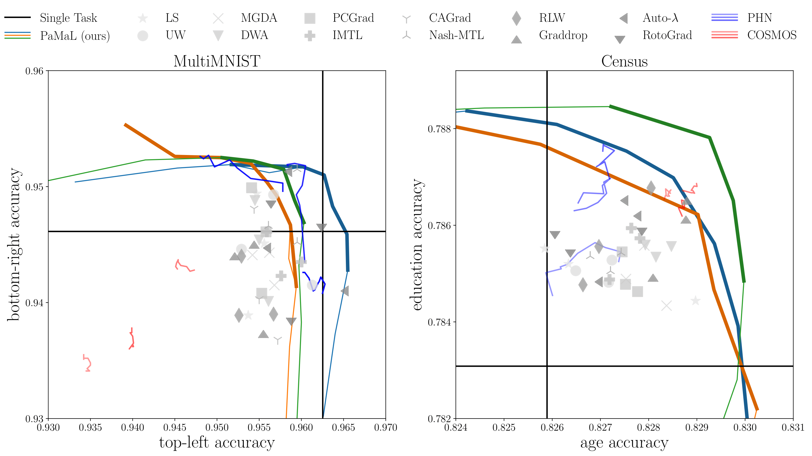

# PaMaL
Official implementation of [Pareto Manifold Learning: Tackling multiple tasks via ensembles of single-task models](https://arxiv.org/abs/2210.09759). 


## Installation

```bash
git clone https://github.com/nik-dim/pamal.git && cd pamal

# Method 1: Conda
conda create -n pamal python=3.10
conda activate pamal
pip install -r requirements.txt

# Method 2: Dockerfile
docker build -t pamal .
```


## Running Experiments

The experiments are configured using [Hydra](https://hydra.cc/). Hydra uses a hierarchical structure to define experiments. See [here](https://hydra.cc/docs/intro/) for more details. 

The configuration files are in the [`configs/`](configs/) directory and are further split into two directories. The first, [`configs/general/`](configs/general/), houses the definitions of methods, optimizers, datasets etc, while the second one,  [`configs/experiment/`](configs/experiment/) makes uses of these definitions to configure the experiments for each dataset. The supported methods are outlined [here](#supported-methods) and the supported datasets [here](#supported-datasets).


For example, we can run experiments on the MultiMNIST dataset as follows:

```bash
# run experiment on MultiMNIST using the proposed method (PaMaL) 
python multimnist.py method=pamal

# ...modify the `inner_method` parameter specific to pamal
python multimnist.py method=pamal method.inner_method=ls # or gradnorm or rwa

# run the same experiment for a baseline
python multimnist.py method=ls # or mgda or phn etc
```

To launch multiple experiments at the same time (e.g. ablation studies), we can use the `--multirun` (`-m`) flag. Note that this flag is sometimes problematic in conjunction with Weights&Biases logging. For example, to run the ablation study for the proposed method, we can run:

```bash
# launch the previous experiment for multiple seeds
python multimnist.py -m method=pamal seed=0,1,2
```
Alternatively, check the [run.sh](run.sh) script for launching multiple experiments.

## Supported Methods

This repository supports the methods outlined in the table below. 
Apart from the proposed method `pamal`, we support Pareto Front Approximation methods `phn` and `cosmos`, as *single solution* methods, such as `rlw`, `graddrop`, `autol`, `rotograd`, `cagrad`, `nashmtl`, `pcgrad`, `dwa`, `si`, `mgda`, `uw`, `ls`, `stl`.

In order to select one baseline set `method=XXX` where `XXX` is the ticker presented below. For example, to run the `ls` baseline, run `python census.py method=ls`.


| Ticker   | Paper                                                                                                                      |
|----------|----------------------------------------------------------------------------------------------------------------------------|
| stlX     | Single-Task Learning for task X, X=0,1,2...                                                                                |
| ls       | Fixed Weighting (e.g. equal)                                                                                               |
| uw       | [Multi-Task Learning Using Uncertainty to Weigh Losses for Scene Geometry and Semantics](https://arxiv.org/abs/1705.07115) |
| mgda     | [Multi-Task Learning as Multi-Objective Optimization](https://arxiv.org/abs/1810.04650)                                    |
| si       | See [Multi-Task Learning as a Bargaining Game](https://arxiv.org/abs/2202.01017) for details                               |
| dwa      | [End-to-End Multi-Task Learning with Attention](https://arxiv.org/abs/1803.10704)                                          |
| pcgrad   | [Gradient Surgery for Multi-Task Learning](https://arxiv.org/abs/2001.06782)                                               |
| imtl     | [Towards Impartial Multi-task Learning](https://openreview.net/forum?id=IMPnRXEWpvr)                                       |
| cagrad   | [Conflict-Averse Gradient Descent for Multi-task Learning](https://arxiv.org/pdf/2110.14048.pdf)                           |
| nashmtl  | [Multi-Task Learning as a Bargaining Game](https://arxiv.org/abs/2202.01017)                                               |
| rlw      | [A Closer Look at Loss Weighting in Multi-Task Learning](https://arxiv.org/pdf/2111.10603.pdf)                             |
| graddrop | [Just Pick a Sign: Optimizing Deep Multitask Models with Gradient Sign Dropout](https://arxiv.org/abs/2010.06808)          |
| autol    | [Auto-Lambda: Disentangling Dynamic Task Relationships](https://arxiv.org/abs/2202.03091)                                  |
| rotograd | [RotoGrad: Gradient Homogenization in Multitask Learning](https://arxiv.org/abs/2103.02631)                                |
| phn      | [Learning the Pareto Front with Hypernetworks](https://arxiv.org/abs/2010.04104)                                           |
| cosmos   | [Scalable Pareto Front Approximation for Deep Multi-Objective Learning](https://arxiv.org/abs/2103.13392)                  |
| pamal    | [Pareto Manifold Learning: Tackling multiple tasks via ensembles of single-task models](https://arxiv.org/abs/2210.09759)  |


## Supported Datasets
The repository supports the datasets in the table below. By default, the datasets will be downloaded to the `~/benchmarks/data` directory. The root path can be modified in [`src/datasets/base_data_module.py`](src/datasets/base_data_module.py).

| Dataset     | Notes                  |
|-------------|------------------------|
| MultiMNIST  | needs to be created    |
| Census      | needs to be downloaded |
| MultiMNIST3 | needs to be created    |
| UtkFace     | needs to be downloaded |
| Cityscapes  | needs to be downloaded |
| CelebA      | needs to be downloaded |


## Extending the codebase
The code is structured similar to PyTorch Lightning. We have used various codebase sources for baselines. For this reason, the API is not consistent for all baselines. Most baselines can be found in [`src/methods/weight_methods.py`](src/methods/weight_methods.py). However, `graddrop`, `autol`, `rotograd`, `phn` and `cosmos` are implemented in their own specific way. In order to add a new `single solution` method, check [`src/methods/weight_methods.py`](src/methods/weight_methods.p) where multiple loss and gradient balancing methods can be found. For `multi solution` methods check [`src/trainer/multi_solution_trainer.py`](src/trainer/multi_solution_trainer.py).

If you have any questions, please contact me. We plan to merge and unify the baselines, with method-specific callbacks. For the moment, this is the case only for Auto-$\lambda$ in [`src/utils/callbacks/auto_lambda_callback.py`](src/utils/callbacks/auto_lambda_callback.py).

## References
The reporsitory makes heavy use of previously developped codebases. Specifically, we use:
1. https://github.com/lorenmt/mtan
2. https://github.com/AvivNavon/nash-mtl
3. https://github.com/AvivNavon/pareto-hypernetworks
4. https://github.com/ruchtem/cosmos
5. https://github.com/adrianjav/rotograd
6. https://github.com/intel-isl/MultiObjectiveOptimization


## Citation
If you find our work useful, please consider citing our paper:
```bibtex
@inproceedings{
    dimitriadis2023pareto,
    title={Pareto Manifold Learning: Tackling multiple tasks via ensembles of single-task models},
    author={Dimitriadis, Nikolaos and Frossard, Pascal and Fleuret, Fran{\c{c}}ois},
    booktitle={International Conference on Machine Learning},
    year={2023},
    url={https://arxiv.org/abs/2210.09759}
}
```

## Contact
If you have any questions, please contact nikolaos.dimitriadis@epfl.ch. 